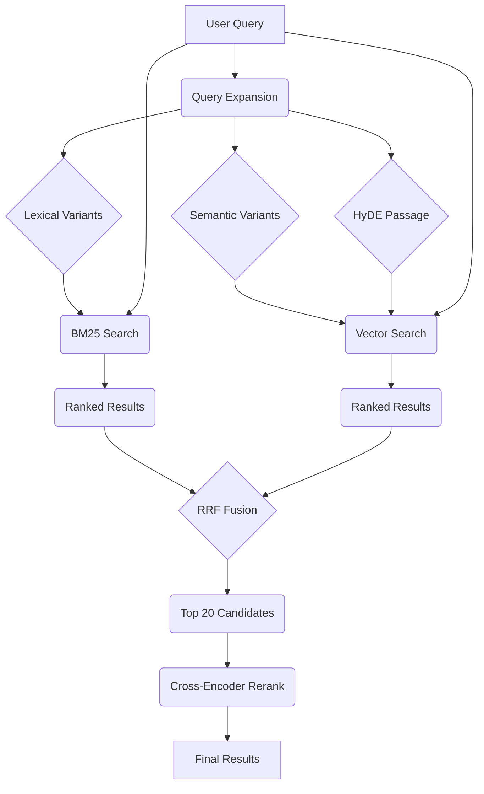

# GNO

**Your Local Second Brain** — Index, search, and synthesize your entire digital life.

[](https://www.npmjs.com/package/@gmickel/gno)
[](./LICENSE)
[](https://gno.sh)
[](https://twitter.com/gmickel)

GNO is a local knowledge engine for privacy-conscious developers and AI agents. Index your notes, code, PDFs, and Office docs. Get hybrid search (BM25 + vector + reranking) and AI-powered answers—all running 100% on your machine.

---

## Contents

- [Quick Start](#quick-start)
- [Installation](#installation)
- [Search Modes](#search-modes)
- [Agent Integration](#agent-integration)
- [How It Works](#how-it-works)
- [Features](#features)
- [Local Models](#local-models)
- [Architecture](#architecture)
- [Development](#development)

---

## Quick Start

```bash
gno init ~/notes --name notes    # Point at your docs
gno index                        # Build search index
gno query "auth best practices"  # Hybrid search
gno ask "summarize the API" --answer  # AI answer with citations
```

---

## Installation

### Install GNO

Requires [Bun](https://bun.sh/) >= 1.0.0.

```bash
bun install -g @gmickel/gno
```

**macOS**: Vector search requires Homebrew SQLite:

```bash
brew install sqlite3
```

Verify everything works:

```bash
gno doctor
```

### Connect to AI Agents

#### MCP Server (Claude Desktop, Cursor, Zed, etc.)

One command to add GNO to your AI assistant:

```bash
gno mcp install                      # Claude Desktop (default)
gno mcp install --target cursor      # Cursor
gno mcp install --target claude-code # Claude Code CLI
gno mcp install --target zed         # Zed
gno mcp install --target windsurf    # Windsurf
gno mcp install --target codex       # OpenAI Codex CLI
gno mcp install --target opencode    # OpenCode
gno mcp install --target amp         # Amp
gno mcp install --target lmstudio    # LM Studio
gno mcp install --target librechat   # LibreChat
```

Check status: `gno mcp status`

#### Skills (Claude Code, Codex, OpenCode)

Skills integrate via CLI—no MCP overhead:

```bash
gno skill install --scope user       # User-wide
gno skill install --target codex     # Codex
gno skill install --target all       # Both Claude + Codex
```

> **Full setup guide**: [MCP Integration](https://gno.sh/docs/MCP/) · [CLI Reference](https://gno.sh/docs/CLI/)

---

## Search Modes

| Command | Mode | Best For |
|:--------|:-----|:---------|
| `gno search` | BM25 | Exact phrases, code identifiers |
| `gno vsearch` | Vector | Natural language, concepts |
| `gno query` | Hybrid | Best accuracy (BM25 + vector + reranking) |
| `gno ask --answer` | RAG | Direct answers with citations |

```bash
gno search "handleAuth"              # Find exact matches
gno vsearch "error handling patterns" # Semantic similarity
gno query "database optimization"    # Full pipeline
gno ask "what did we decide" --answer # AI synthesis
```

Output formats: `--json`, `--files`, `--csv`, `--md`, `--xml`

---

## Agent Integration

### MCP Server

GNO exposes 6 tools via [Model Context Protocol](https://modelcontextprotocol.io):

| Tool | Description |
|:-----|:------------|
| `gno_search` | BM25 keyword search |
| `gno_vsearch` | Vector semantic search |
| `gno_query` | Hybrid search (recommended) |
| `gno_get` | Retrieve document by ID |
| `gno_multi_get` | Batch document retrieval |
| `gno_status` | Index health check |

**Design**: MCP tools are retrieval-only. Your AI assistant (Claude, GPT-4) synthesizes answers from retrieved context—best retrieval (GNO) + best reasoning (your LLM).

### Skills

Skills add GNO search to Claude Code/Codex without MCP protocol overhead:

```bash
gno skill install --scope user
```

Then ask your agent: *"Search my notes for the auth discussion"*

> **Detailed docs**: [MCP Integration](https://gno.sh/docs/MCP/) · [Use Cases](https://gno.sh/docs/USE-CASES/)

---

## How It Works



1. **Query Expansion** — LLM generates lexical variants, semantic rephrases, and a [HyDE](https://arxiv.org/abs/2212.10496) passage
2. **Parallel Retrieval** — BM25 + vector search run concurrently on all variants
3. **Fusion** — Reciprocal Rank Fusion merges results with position-based scoring
4. **Reranking** — Cross-encoder rescores top 20, blended with fusion scores

> **Deep dive**: [How Search Works](https://gno.sh/docs/HOW-SEARCH-WORKS/)

---

## Features

| Feature | Description |
|:--------|:------------|
| **Hybrid Search** | BM25 + vector + RRF fusion + cross-encoder reranking |
| **Multi-Format** | Markdown, PDF, DOCX, XLSX, PPTX, plain text |
| **Local LLM** | AI answers via llama.cpp—no API keys |
| **Privacy First** | 100% offline, zero telemetry, your data stays yours |
| **MCP Server** | Works with Claude Desktop, Cursor, Zed, + 8 more |
| **Collections** | Organize sources with patterns, excludes, contexts |
| **Multilingual** | 30+ languages, auto-detection, cross-lingual search |
| **Incremental** | SHA-256 tracking—only changed files re-indexed |

---

## Local Models

Models auto-download on first use to `~/.cache/gno/models/`.

| Model | Purpose | Size |
|:------|:--------|:-----|
| bge-m3 | Embeddings (1024-dim, multilingual) | ~500MB |
| bge-reranker-v2-m3 | Cross-encoder reranking | ~700MB |
| Qwen/SmolLM | Query expansion + AI answers | ~600MB-1.2GB |

### Model Presets

| Preset | Disk | Best For |
|:-------|:-----|:---------|
| `slim` | ~1GB | Fast, lower quality |
| `balanced` | ~2GB | Good balance (default) |
| `quality` | ~2.5GB | Best answers |

```bash
gno models use balanced
gno models pull --all
```

> **Configuration**: [Model Setup](https://gno.sh/docs/CONFIGURATION/)

---

## Architecture

```
┌─────────────────────────────────────────────────┐
│                 GNO CLI / MCP                   │
├─────────────────────────────────────────────────┤
│  Ports: Converter, Store, Embedding, Rerank    │
├─────────────────────────────────────────────────┤
│  Adapters: SQLite, FTS5, sqlite-vec, llama-cpp │
├─────────────────────────────────────────────────┤
│  Core: Identity, Mirrors, Chunking, Retrieval  │
└─────────────────────────────────────────────────┘
```

> **Details**: [Architecture](https://gno.sh/docs/ARCHITECTURE/)

---

## Development

```bash
git clone https://github.com/gmickel/gno.git && cd gno
bun install
bun test
bun run lint && bun run typecheck
```

> **Contributing**: [CONTRIBUTING.md](.github/CONTRIBUTING.md)

---

## License

[MIT](./LICENSE)

---

<p align="center">
  made with ❤️ by <a href="https://twitter.com/gmickel">@gmickel</a>
</p>
